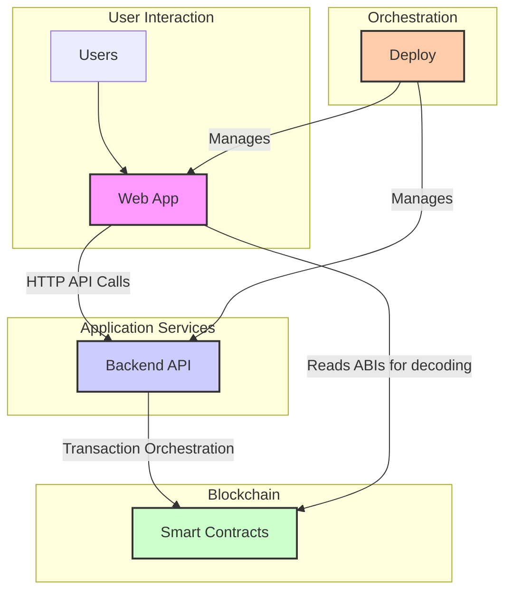

# Welcome to Arras Labs

In a world where property investment is often a privilege of the wealthy, we are on a mission to tear down the barriers. Our goal is to revolutionise the real estate market, transforming it from an exclusive club into an open, inclusive, and liquid ecosystem for everyone.

We are building a platform to tokenise property, allowing anyone to invest in bricks and mortar with the same ease as buying a share. Imagine owning a fraction of a home, earning returns from rent, and having a say in a market that has been out of reach for too long.

This is more than just a project; it's a movement towards radical change. We believe in a future where financial empowerment is not determined by your background, but by your ambition. Join us in building a more equitable and accessible world.

## Project Overview

The Arras platform is composed of several microservices and applications that work together. Here is a breakdown of our active repositories:

### Active Repositories

These are the projects that are currently under active development.

| Repository | Description |
| :--- | :--- |
| [`web-app`](https://github.com/arras-labs/web-app) | Frontend application for end-users and operators. Reads on-chain data and calls server APIs. |
| [`backend-api`](https://github.com/arras-labs/backend-api) | Exposes application APIs and mediates writes to the blockchain, applying domain rules and security. |
| [`contracts`](https://github.com/arras-labs/contracts) | Authors and tests the smart contracts. Produces ABIs as build artefacts for other services. |
| [`deploy`](https://github.com/arras-labs/deploy) | Runs the full system locally and defines deployment manifests for staging/production. |

### Archived Repositories

These projects are not in active development but are kept for historical or reference purposes.
*(You can list your archived repositories here)*

## Getting Started

If you are new to the project, we recommend starting here:

1.  **Clone the `deploy` repository:** This will allow you to run the entire system locally using Docker Compose.
2.  **Familiarize yourself with the architecture:** The diagram below shows how the services interact.
3.  **Check out the `CONTRIBUTING.md`:** Each repository has its own contribution guidelines.

## Project Architecture

Here is a high-level overview of how the main components of the Arras platform interact:

*(This diagram reflects the interactions between the `web-app`, `backend-api`, `contracts`, and `deploy` repositories.)*

